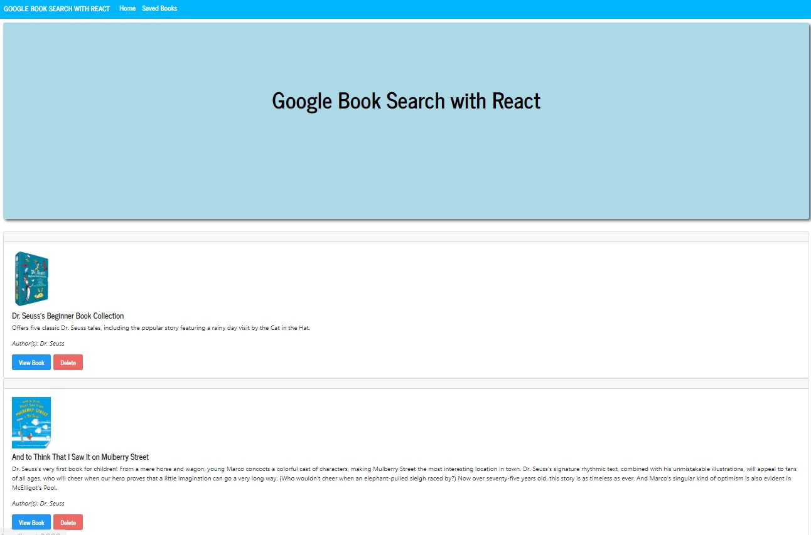

## Google Books Search built with React 

This application was created using the MERN stack. It allows users to search for books via the Google Books API. Search results are rendered dynamically in the UI. Users have the option to view, save and/or delete books.

### Tech Used:
 - React JS
 - Express JS
 - MongoDB
 - Mongoose
 - Node
 - Axios

## Description:

1. Users are brought to the `Home` page where they can begin their search for any book. The Book information is retrived via the Google Books API.

2. When searching for a book, users will see a list of relevant results. They can click `save` to save the book to the `Saved` page. The book is saved to the Mongo DB on the back end.

3. Users can save as many books as they like. When they go to the `Saved` page, they will not only see books that they saved, but also other visitor's saved books. 

4. Users can click the `View Book` button from either the `Home` or `Saved` pages. This will redirect them to the Google Books store page where they can either read a preview of the book or purchase it.

5. To remove a saved book from the list, the user can click the `Delete` button to remove the book from the page. This also deletes the document from the Mongo DB.

#### Search, save, view, and delete books:   

Demo Link: https://drive.google.com/file/d/1ljb-v66QG9_xPuuLdUcGtyESDfOmqtoY/view

---

## Installation & Setup:

You can clone or fork this repo. You will need `node`, `npm`, and `MongoDB` installed globally on your machine.

View the repo at: <b><a href="https://github.com/pat31477/Google-Book-Search" target="_blank">https://github.com/pat31477/Google-Book-Search</a></b>

Installation:

`npm install`  

Start Server:

`npm start`  

View App:

`localhost:3001`  

## Links:

Github Repository: https://github.com/chloeyu17/Google-Book-Search/

Heroku: 

## Contributing:

Huge Thank you to Chloe Yu, Gabe Thomas, Jason Barbanel, and Steven Paul for all of their help, guidance, assistance and for checking my work to make sure it was done correctly. 

You can view their work and repos here:

  

  

  

  
